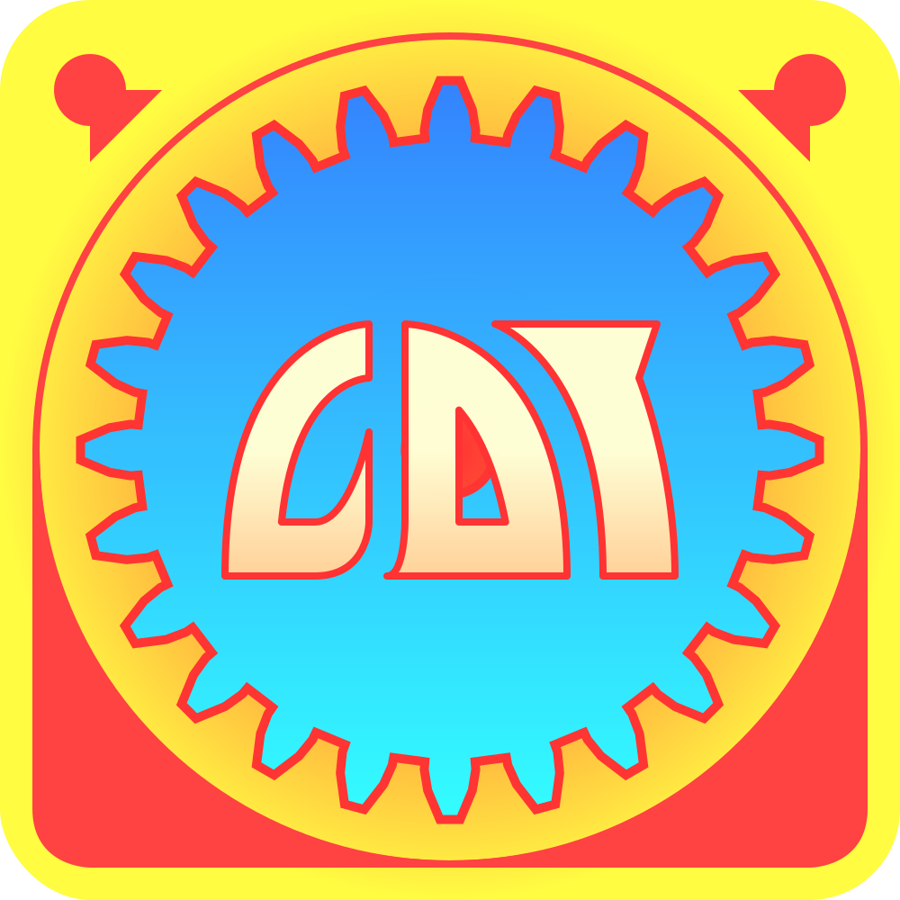

# CountDownTown
Countdown timer gui app, based on crossplatform libgdx framework, using kotlin.  
Available releases for linux, win, mac, android(not polished, just ported) on [playstore](https://play.google.com/store/apps/details?id=io.guthub.healingdrawing.countdowntown)

---
Save/load functionality with several repeatable tunes.  

---
Volume control, using gui.  

